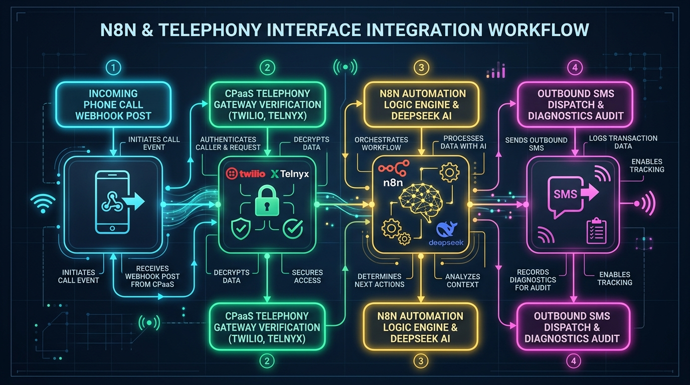

# The 30-Minute Missed-Call Text-Back Engine: Turnkey Deployment & Reselling Spec

> **A Warm, Supportive Blueprint & Micro-SaaS Business Package**  
> Built for freelance developers, tech consultants, agency owners, and affiliate sellers.

---

## Welcome Friend! 

Welcome to the **30-Minute Missed-Call Text-Back Engine** repository! If you are looking for a simple, reliable way to build a recurring monthly income stream without the stress of giant agency overhead, you are in the right place. Take a deep breath and explore at your own comfortable pace—you are fully supported every step of the way!

---

## 🛠️ Complete Technical Workbooks & Field Guides

- **[`n8n_telephony_setup_workbook.md`](./n8n_telephony_setup_workbook.md):** Complete N8N & Telephony Interface Setup Workbook (Railway Cloud hosting, Twilio/Telnyx/Sent.dm/Sendillo webhook wiring, node-by-node JavaScript code, 5-step stress testing, and master troubleshooting SOP matrix).
- **[`payhip_setup_masterclass_ebook.md`](./payhip_setup_masterclass_ebook.md):** eBook guide for setting up Payhip products, building a 20x sales page that sells, and executing the 5-step testing protocol.
- **[`15_minute_intake_questionnaire.md`](./15_minute_intake_questionnaire.md):** Client technical intake questionnaire with customizable agency header card.

---

## 🛍️ Payhip Standard Product Description Editor Copy

- **[`payhip_standard_editor_master.md`](./payhip_standard_editor_master.md):** Master Product Description copy for Payhip's native standard editor.
- **[`payhip_standard_editor_tier1_diy.md`](./payhip_standard_editor_tier1_diy.md):** Native description copy for Tier 1: Affiliate DIY Access ($24.99).
- **[`payhip_standard_editor_tier2_standard.md`](./payhip_standard_editor_tier2_standard.md):** Native description copy for Tier 2: Standard Complete Package ($49.99 - Flagship Offer).
- **[`payhip_standard_editor_tier3_dfy.md`](./payhip_standard_editor_tier3_dfy.md):** Native description copy for Tier 3: DFY Agency Installation ($124.99).

---

## 🌐 Blockbuster Full-Color HTML Sales Pages

- **[`sales_page_master.html`](./sales_page_master.html):** Master Multi-Tier Blockbuster Sales Landing Page showcasing all 3 offer tiers ($24.99, $49.99, $124.99).
- **[`sales_page_tier1_diy.html`](./sales_page_tier1_diy.html):** Dedicated full-color HTML sales page for Tier 1 ($24.99).
- **[`sales_page_tier2_standard.html`](./sales_page_tier2_standard.html):** Dedicated blockbuster HTML sales page for Tier 2 ($49.99).
- **[`sales_page_tier3_dfy.html`](./sales_page_tier3_dfy.html):** Dedicated full-color HTML sales page for Tier 3 ($124.99).

---

## 🎨 System Graphics & Visual Architecture

### 1. N8N & Telephony Integration Workflow

### 2. System Architecture Logic Map

### 3. Payhip 20x Sales Funnel Architecture

### 4. Payhip Product Tier Configuration

### 5. 20x Value Stack Breakdown

### 6. Omni-Channel Social Media & Video Ad Funnel

### 7. Payhip 30% Affiliate Program & Payout Flow

### 8. Contractor Onboarding Workflow

### 9. Payhip 5-Step Testing Protocol

---

## 📁 Repository Structure & Teaching Approach

Every document in this repository follows a clean, 5-part teaching approach embedded directly into the content:
1. **Section Roadmap & Overview** (Clear Section Preview)
2. **Context & Business Motivation** (Why This Step Matters & WIIFM)
3. **Core Technical Content & Procedures** (Step-by-Step Instructions & Production Code)
4. **Key Takeaways & Section Summary** (Summary Recap)
5. **Milestone Celebration** (Progress & Encouragement)

---

## 📄 Key Repository Files

- **[`n8n_telephony_setup_workbook.md`](./n8n_telephony_setup_workbook.md):** Complete N8N & Telephony Interface Setup Workbook.
- **[`outreach_toolkit.md`](./outreach_toolkit.md):** Complete omni-channel sales and marketing toolkit for Agency & Affiliate sellers.
- **[`affiliate_recruitment_page.md`](./affiliate_recruitment_page.md):** 30% affiliate recruitment page.
- **[`affiliate_terms_and_conditions.md`](./affiliate_terms_and_conditions.md):** Official affiliate program terms and conditions.
- **[`privacy_disclaimer.md`](./privacy_disclaimer.md):** Privacy policy, TCPA disclosures, and legal disclaimers.
- **[`blueprint_spec.md`](./blueprint_spec.md):** Master 6-module technical specification blueprint.
- **[`n8n_missed_call_textback_workflow.json`](./n8n_missed_call_textback_workflow.json):** 1-click importable N8N JSON workflow schema.

---

## 🚀 Quick Start Steps

1. **Follow N8N & Telephony Workbook:** Open [`n8n_telephony_setup_workbook.md`](./n8n_telephony_setup_workbook.md) to deploy on Railway (`railway.app`), wire Twilio/Telnyx webhooks, and execute load testing.
2. **Copy Payhip Standard Descriptions:** Paste [`payhip_standard_editor_tier2_standard.md`](./payhip_standard_editor_tier2_standard.md) into your Payhip product description editor.
3. **Host HTML Sales Pages:** Open [`sales_page_master.html`](./sales_page_master.html) in your browser or landing page builder.
4. **Import N8N Workflow:** Load `n8n_missed_call_textback_workflow.json` into N8N.
5. **Launch Outreach:** Use [`outreach_toolkit.md`](./outreach_toolkit.md) for social media and video ad promotion!
