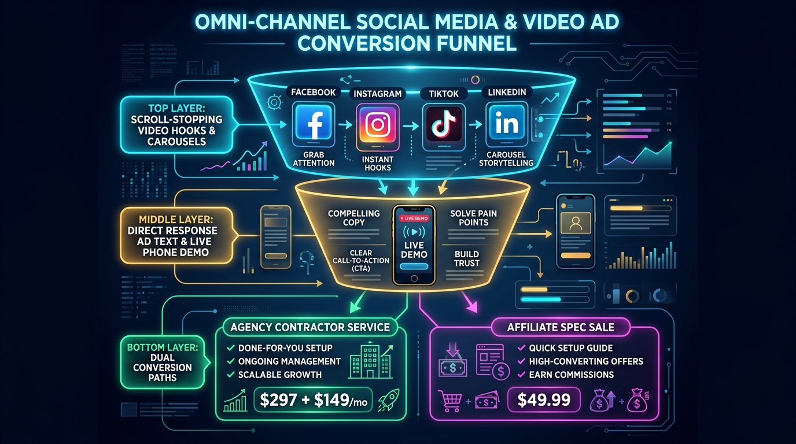
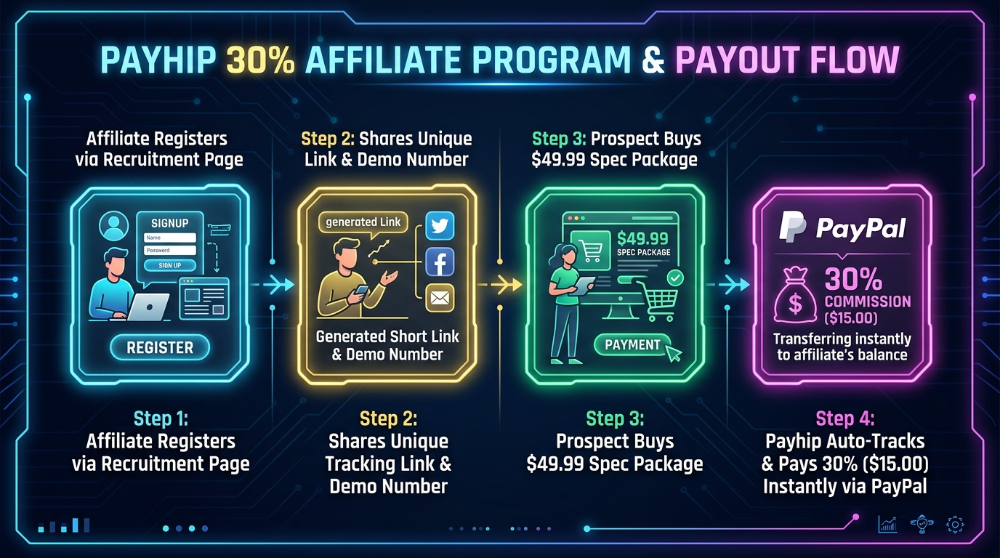
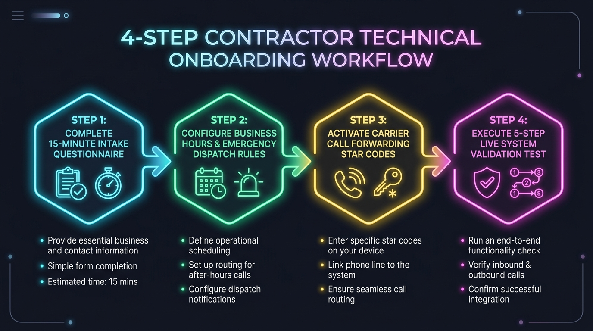

# The 30-Minute Missed-Call Text-Back Engine: Turnkey Deployment & Reselling Spec

> **A Warm, Supportive Blueprint & Micro-SaaS Business Package**  
> Built for freelance developers, tech consultants, agency owners, and affiliate sellers.

---

## Welcome Friend! 

Welcome to the **30-Minute Missed-Call Text-Back Engine** repository! If you are looking for a simple, reliable way to build a recurring monthly income stream without the stress of giant agency overhead, you are in the right place. Take a deep breath and explore at your own comfortable pace—you are fully supported every step of the way!

---

## 🎨 System Graphics & Visual Architecture

### 1. System Architecture Logic Map

### 2. Payhip 20x Sales Funnel Architecture

### 3. Payhip Product Tier Configuration

### 4. 20x Value Stack Breakdown

### 5. Omni-Channel Social Media & Video Ad Funnel

### 6. Payhip 30% Affiliate Program & Payout Flow

### 7. Contractor Onboarding Workflow

### 8. Payhip 5-Step Testing Protocol

---

## 📁 Repository Structure & Teaching Approach

Every document in this repository follows a clean, 5-part teaching approach embedded directly into the content:
1. **Section Roadmap & Overview** (Clear Section Preview)
2. **Context & Business Motivation** (Why This Step Matters & WIIFM)
3. **Core Technical Content & Procedures** (Step-by-Step Instructions & Production Code)
4. **Key Takeaways & Section Summary** (Summary Recap)
5. **Milestone Celebration** (Progress & Encouragement)

---

## 📄 Key Repository Files

- **[`outreach_toolkit.md`](./outreach_toolkit.md):** Complete omni-channel sales and marketing toolkit with separate sections for **Agency Sellers** and **Affiliate Sellers** across Facebook, Instagram, TikTok, and LinkedIn (including scroll-stopping hooks, post captions, 30s short video scripts, multi-slide carousels, direct response ad copy, and 45s video ad scripts).
- **[`affiliate_recruitment_page.md`](./affiliate_recruitment_page.md):** High-converting partner recruitment page showcasing our 30% commission structure, payout math, and 3-step registration flow.
- **[`affiliate_terms_and_conditions.md`](./affiliate_terms_and_conditions.md):** Official affiliate program terms, promotional rules, cookie tracking window (60 days), and zero-tolerance spam guidelines.
- **[`privacy_disclaimer.md`](./privacy_disclaimer.md):** Comprehensive privacy policy, TCPA telephony disclosures, 10DLC transparency rules, and commercial earnings disclaimer.
- **[`15_minute_intake_questionnaire.md`](./15_minute_intake_questionnaire.md):** Client technical intake questionnaire with customizable agency header card.
- **[`payhip_setup_masterclass_ebook.md`](./payhip_setup_masterclass_ebook.md):** eBook guide for setting up Payhip products, building a 20x sales page that sells, and executing the 5-step testing protocol.
- **[`blueprint_spec.md`](./blueprint_spec.md):** Master 6-module technical specification blueprint covering architecture, carrier benchmarks, N8N step-by-step nodes, SMS template library, onboarding SOPs, lead gen audit machine, and TCPA/10DLC compliance.
- **[`n8n_missed_call_textback_workflow.json`](./n8n_missed_call_textback_workflow.json):** 1-click importable N8N JSON workflow schema.
- **[`sales_copy_payhip.md`](./sales_copy_payhip.md):** High-converting Payhip sales landing page copy.

---

## 🚀 Quick Start Steps

1. **Read Payhip Masterclass eBook:** Follow [`payhip_setup_masterclass_ebook.md`](./payhip_setup_masterclass_ebook.md) to launch and test your Payhip store.
2. **Import N8N Workflow:** Load `n8n_missed_call_textback_workflow.json` into N8N.
3. **Launch Marketing & Ads:** Use [`outreach_toolkit.md`](./outreach_toolkit.md) for Agency or Affiliate promotions on FB, IG, TikTok, and LinkedIn.
4. **Recruit Affiliate Partners:** Share [`affiliate_recruitment_page.md`](./affiliate_recruitment_page.md) with tech content creators and developer communities.
5. **Send Intake Questionnaire:** Hand [`15_minute_intake_questionnaire.md`](./15_minute_intake_questionnaire.md) to new contractor clients!
