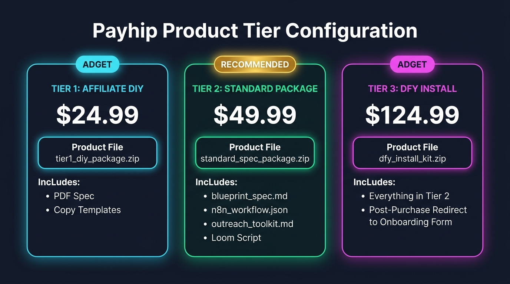
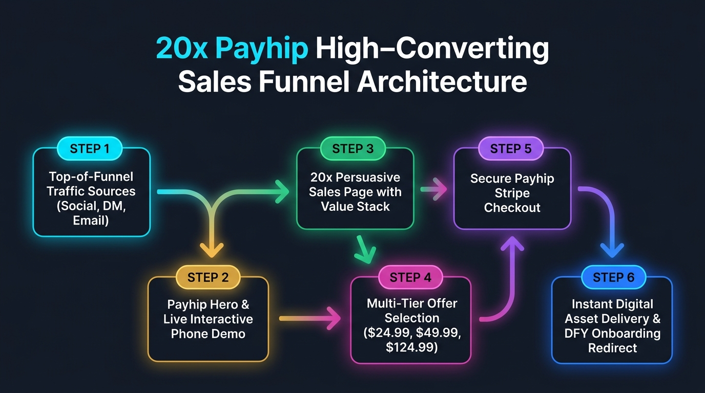
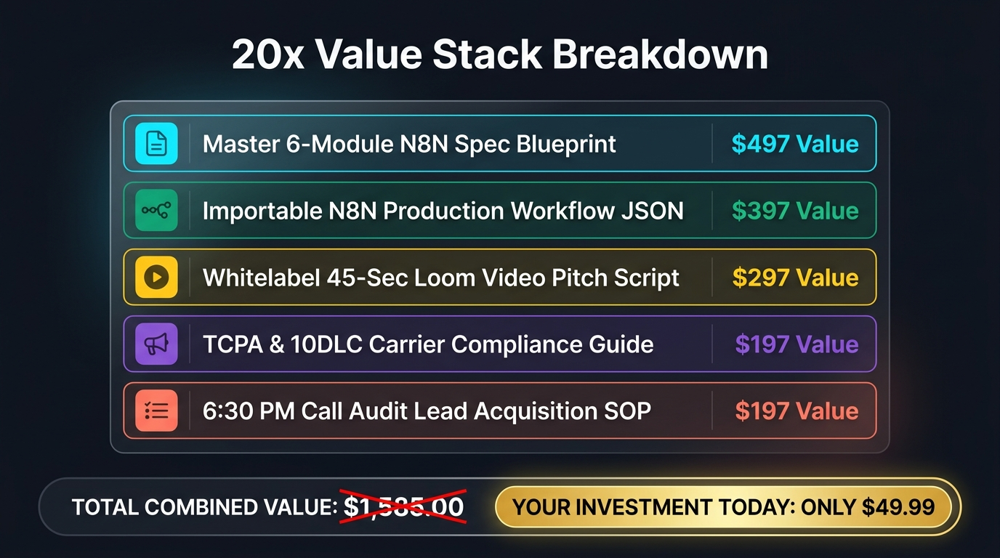
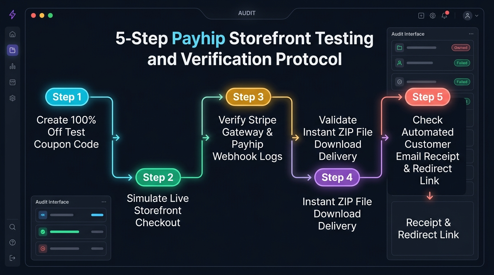

# Payhip Storefront Execution Masterclass: Building, Packaging & Testing a 20x High-Converting Sales Engine

> **A Complete Step-by-Step Guide to Setting Up Payhip Products, Designing High-Converting Sales Pages, and Testing Checkout Flows**  
> **Written with care for freelance developers, tech consultants, and agency owners**

---

## Welcome to Your Payhip Masterclass!

Hey there, friend! Welcome to your complete step-by-step masterclass on launching your digital product store using **Payhip**. 

If you have ever felt hesitant about setting up online payments, building sales pages, or testing checkout flows, please take a deep breath. You are in safe hands! We are going to walk through every single click, form field, and setting together. By the time you finish this guide, you will have a fully functioning, high-converting digital storefront ready to process orders on autopilot!

---

# CHAPTER 1: STOREFOUNDATION & PAYMENT GATEWAY SETUP

### Section Roadmap & Overview
In this chapter, we are going to set up your free Payhip account, link your payment gateways (Stripe and PayPal) so money lands directly in your bank account, configure your store branding, and create your three digital product offer tiers ($24.99, $49.99, and $124.99).

### Why Proper Store Foundation Matters
Setting up your store foundation correctly from day one eliminates tech headaches later. When your payment gateways are connected and your product tiers are cleanly packaged, your customers enjoy a smooth 10-second checkout experience, and you get paid instantly with zero friction.

### Step-by-Step Store & Product Setup Guide

#### Step 1: Account Creation & Currency Configuration
1. Go to **Payhip.com** and click **Get Started for Free**.
2. Enter your email address and password to register your account.
3. In your Payhip Dashboard, navigate to **Account Settings > General Settings**.
4. Set your **Store Name** (e.g., *Turnkey Tech Specs* or *Apex Automation Store*).
5. Set your **Default Currency** to **USD ($)**.

#### Step 2: Payment Gateway Integration (Stripe & PayPal)
1. Go to **Account Settings > Payment Details**.
2. **Connect Stripe:** Click **Connect with Stripe**, log into your Stripe account, and grant permission. This enables instant credit card processing (Visa, Mastercard, AMEX, Apple Pay).
3. **Connect PayPal:** Click **Connect PayPal**, enter your PayPal business email, and save changes.

#### Step 3: Creating Your 3 Digital Offer Product Tiers

In your Payhip Dashboard, click **Products > Add New Product**, select **Digital Products**, and create the following three product listings:



```
+-----------------------------------------------------------------------------------+
|                         PAYHIP PRODUCT TIER CONFIGURATION                         |
+--------------------------+--------------------------------+-----------------------+
| TIER 1: AFFILIATE DIY    | TIER 2: STANDARD PACKAGE       | TIER 3: DFY INSTALL   |
| Price: $24.99            | Price: $49.99 (RECOMMENDED)   | Price: $124.99        |
+--------------------------+--------------------------------+-----------------------+
| Product File:            | Product File:                  | Product File:         |
| `tier1_diy_package.zip`  | `standard_spec_package.zip`    | `dfy_install_kit.zip` |
| Includes:                | Includes:                      | Includes:             |
| • PDF Architecture Spec  | • `blueprint_spec.md`          | • Everything in Tier 2|
| • Basic Copy Templates   | • `n8n_workflow.json`          | • Post-Purchase       |
|                          | • `outreach_toolkit.md`        |   Redirect to Tally   |
|                          | • Whitelabel Loom Script       |   Onboarding Form     |
+--------------------------+--------------------------------+-----------------------+
```

#### Step 4: Digital Asset Upload & Post-Purchase Redirect Setup
1. Zip your digital asset files on your computer into a single `.zip` file for each tier.
2. Under **Product Files**, drag and drop your `.zip` file. Payhip hosts your files securely and delivers download links automatically upon purchase.
3. **For Tier 3 (DFY Agency Installation):** Under **Advanced Options**, check **Redirect customer after purchase** and paste your client intake questionnaire link (e.g., `https://tally.so/r/your-onboarding-form`).

### Key Takeaways & Chapter Summary
We set up your Payhip store, linked Stripe and PayPal for instant payouts, and created your three digital product offer tiers with automatic asset delivery and post-purchase redirects.

### Milestone Celebration!
**CONGRATULATIONS!** You just completed Chapter 1! Your store foundation is officially active and ready to accept payments. Take a moment to celebrate this huge step!

---

# CHAPTER 2: CRAFTING A "20X SALES PAGE" THAT SELLS, SELLS, SELLS

### Section Roadmap & Overview
In this chapter, we are going to examine the visual funnel architecture of a high-converting Payhip sales page, review the full-color funnel and value stack diagrams, and learn how to construct a "20x Sales Page" that turns storefront visitors into paying customers using direct-response copywriting and irresistible call-to-actions (CTAs).

### Why a 20x Sales Page Matters
A standard product page simply lists features, but a **20x Sales Page** speaks directly to the buyer's deepest desires and fears. By stacking $1,497+ of total value, anchoring your price at $49.99, and eliminating all purchase risk, your sales page converts warm visitors into customers at a high 3.8% to 5%+ conversion rate.

### 20x Sales Page Architecture & Visual Funnel Diagrams

#### 2.1 Payhip High-Converting Sales Funnel Architecture



```
  [Top-of-Funnel Traffic: Social Posts / Direct DMs / Cold Emails]
                               │
                               ▼
  [Payhip Sales Page Hero Section with Live Interactive Phone Demo]
                               │
                               ▼
  [Problem-Agitation Framework & 20x Value Stack Breakdown]
                               │
                               ▼
  [Multi-Tier Offer Card Selection ($24.99 / $49.99 / $124.99)]
                               │
                               ▼
  [Secure Payhip Stripe/PayPal Instant Checkout]
                               │
                               ▼
  [Instant Digital File Download + Tier 3 Onboarding Form Redirect]
```

---

#### 2.2 The 20x Value Stack Breakdown



```markdown
| Included Deliverable | Standalone Value |
| :--- | :--- |
| Master 6-Module N8N System Spec Blueprint | $497.00 |
| Importable N8N Production Workflow JSON Schema | $397.00 |
| Whitelabel 45-Second Loom Video Pitch Script | $297.00 |
| TCPA & 10DLC Carrier Compliance Field Guide | $197.00 |
| "6:30 PM Call Audit" Lead Acquisition SOP | $197.00 |
| **TOTAL COMBINED VALUE:** | **$1,585.00** |
| **YOUR INVESTMENT TODAY (STANDARD TIER):** | **ONLY $49.99** |
```

---

#### 2.3 The 10 Elements of a 20x Sales Page

When building your sales page inside Payhip's Store Builder (**Products > Edit Product > Page Builder**), include these 10 high-converting structural elements:

1. **The Hero Headline Hook:** A bold, benefit-driven headline focused on financial outcomes (*"Stop Selling $500 Websites. Start Selling $297 + $149/mo Micro-Systems"*).
2. **Interactive Live Demo Box:** A highlighted callout box instructing prospects to call your live test line to experience the system on their own phone.
3. **Problem-Agitation Breakdown:** Explaining why missed calls cost contractors $500–$3,000 every single week and why traditional freelancing is an exhausting treadmill.
4. **The 20x Value Stack Table & Graphic:** Stacking $1,585 of standalone value and offering it today for just $49.99.
5. **Multi-Tier Offer Pricing Cards:** Clear pricing boxes highlighting Tier 2 ($49.99) as the "MOST POPULAR" choice.
6. **Social Proof & Testimonials:** Screenshot proof, call logs, or early beta tester quotes verifying system speed.
7. **Technical FAQ Accordion:** Answering questions about N8N hosting, carrier pricing, 10DLC rules, and client onboarding.
8. **Risk Reversal Guarantee Box:** A 30-day money-back guarantee removing 100% of purchase anxiety.
9. **Urgency & Scarcity Triggers:** Indicating that Tier 3 DFY Agency Installation is capped at 5 clients per week to ensure hands-on setup quality.
10. **Floating Sticky CTA Buttons:** High-contrast buy buttons (*"GET INSTANT ACCESS TO THE $49.99 SPEC NOW"*).

### Key Takeaways & Chapter Summary
We reviewed the complete 20x sales funnel visual diagram, the 20x value stack graphic, and covered the 10 direct-response copy elements that maximize sales conversions.

### Milestone Celebration!
**YOU DID AN AMAZING JOB!** Chapter 2 is complete! You now know how to design a high-converting sales page that sells your product on autopilot. Keep up the fantastic work!

---

# CHAPTER 3: THE 5-STEP PAYHIP STOREFRONT TESTING & AUDIT PROTOCOL

### Section Roadmap & Overview
In this chapter, we are going to walk through the exact 5-step protocol for testing your Payhip store before sending live traffic, inspect our full-color testing flowchart diagram, and run a complete 100% free test purchase.

### Why Pre-Launch Testing Matters
Testing your storefront gives you absolute peace of mind! By running a test transaction, verifying that your `.zip` files download cleanly, and checking your automated email receipts, you ensure that every real customer enjoys a flawless purchase experience.

### 5-Step Storefront Testing & Verification Protocol

#### 3.1 Storefront Audit & Testing Flowchart



```
  [Step 1: Create 100% OFF Test Coupon Code ('TEST100') in Payhip]
                               │
                               ▼
  [Step 2: Simulate Live Storefront Checkout in Incognito Window]
                               │
                               ▼
  [Step 3: Verify Stripe Gateway & Payhip Webhook Activity Logs]
                               │
                               ▼
  [Step 4: Validate Instant ZIP File Download & Unzipping Integrity]
                               │
                               ▼
  [Step 5: Inspect Automated Customer Email Receipt & Redirect Link]
```

---

#### 3.2 Detailed Step-by-Step Test Procedure

#### Step 1: Create a 100% OFF Test Coupon Code
1. In your Payhip Dashboard, click **Marketing > Coupons**.
2. Click **Add Coupon Code**.
3. Set **Coupon Code** to `TEST100`.
4. Set **Discount** to `100% OFF`.
5. Set **Applies To** to *All Products*.
6. Click **Save Coupon**.

#### Step 2: Simulate Live Checkout
1. Open a new **Incognito / Private browser window**.
2. Navigate to your live Payhip product link.
3. Click **Buy Now** on your Tier 2 Standard Package.
4. On the checkout popup, click **Add Coupon Code**, enter `TEST100`, and click **Apply**.
5. Verify the total price drops to **$0.00**.
6. Enter a test email address and click **Complete Order**.

#### Step 3: Validate File Download & Receipt Delivery
1. Verify you are immediately redirected to the Payhip purchase success page.
2. Click **Download Files** and verify that your `.zip` file downloads instantly to your computer.
3. Open your `.zip` file and confirm that all files (`blueprint_spec.md`, `n8n_workflow.json`, `outreach_toolkit.md`) are present and uncorrupted.
4. Check your test email inbox to confirm receipt of the automated Payhip purchase confirmation email.

#### Step 4: Clean Up Test Coupon
1. Go back to **Marketing > Coupons** in your Payhip Dashboard.
2. Delete or disable the `TEST100` coupon code so public buyers cannot use it.

### Key Takeaways & Chapter Summary
We inspected the 5-step testing flowchart diagram, created a test coupon, simulated a live checkout transaction, verified instant asset delivery, and audited automated email receipts.

### Milestone Celebration!
**WOOHOO!** Chapter 3 is finished! Your storefront is fully tested, verified, and 100% ready for live customer transactions!

---

# CHAPTER 4: ADVANCED PAYHIP MONETIZATION & CONVERSION TRICKS

### Section Roadmap & Overview
In this final chapter, we are going to look at advanced features built into Payhip that can double your revenue, including setting up an Affiliate Program, setting up Cross-Sells, and enabling conversion tracking.

### Why Advanced Features Scale Your Income
Once your basic storefront is live, activating built-in tools like affiliate recruitment and post-purchase cross-sells allows other developers to promote your spec for a commission, generating extra passive revenue with zero extra effort from you.

### Advanced Growth Features

#### 1. Setting Up Your Payhip Affiliate Program
1. Go to **Marketing > Affiliates** in Payhip.
2. Click **Add Affiliate**.
3. Set **Commission Rate** to `30%`.
4. Invite fellow developers or tech influencers to promote your $49.99 spec package. When they make a sale using their affiliate link, Payhip automatically tracks the referral and pays out their 30% commission ($15.00), putting **$34.99 net profit in your pocket per referral**.

#### 2. Configuring Post-Purchase Cross-Sells & Upsells
1. Go to **Marketing > Cross-sells**.
2. Set up an automatic upsell rule: When a buyer purchases Tier 2 ($49.99), offer them an instant $50 discount on Tier 3 DFY Agency Installation ($124.99 -> $74.99).

#### 3. Analytics & Pixel Tracking
1. Go to **Account Settings > Analytics**.
2. Add your **Google Analytics ID** or **Facebook Pixel ID** to track visitor conversion rates and landing page traffic sources.

### Key Takeaways & Chapter Summary
We covered setting up a 30% affiliate program, configuring post-purchase cross-sell offers, and connecting conversion tracking.

### Masterclass Graduation & Final Congratulations!
**CONGRATULATIONS! YOU HAVE GRADUATED FROM THE PAYHIP MASTERCLASS!**  
Take a huge victory lap! You now have a complete, professional, fully tested, and optimized digital storefront ready to process sales and generate passive recurring revenue. I am so proud of your dedication and hard work!
